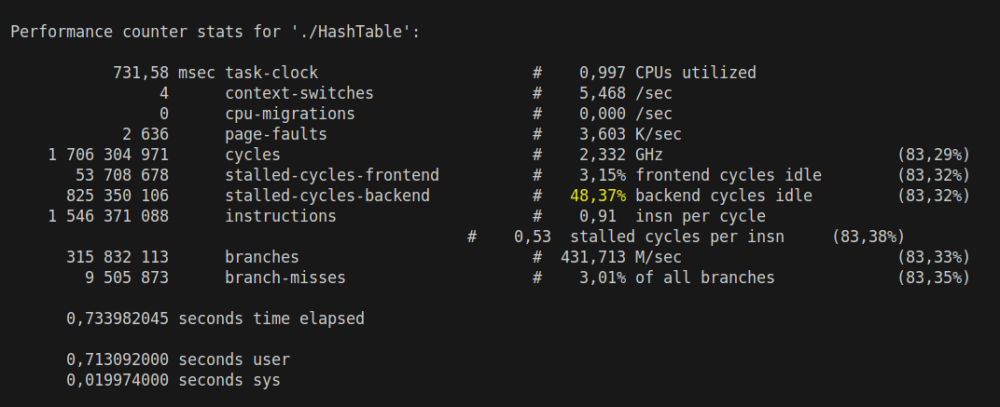

# Хэш-Таблица и её оптимизации

## Что такое хэш-таблица и не только

### Хэш-функция
Это функция, которая получает ключ и возвращает хэш. Ключом может быть любой тип данных: число или строка, например. Хэш тоже может быть любым нужным типом данных, обычно, это число. Если хэш-функция должна вернуть два одинаковых хэша, получив одинаковые ключи.

Например ($hash = key$) уже хэш функция!

### Действия
В хэш-таблице хранятся пары (ключ; значение), которые можно:

1. Вставить пару
2. Удалить пару
3. Найти пару

По своей сути, хэш-таблица - это прокачанный массив, в котором поиск происходит за $O(1)$ в лучшем случае и $O(n)$ в худшем (когда много коллизий). Это гораздо быстрее массива

### Коллизии
Простыми словами: получение одинакового хэша при хэшировании разных ключей

### Как бороться с коллизиями?
Есть много способов: открытое хэширование, кукушкино, идеальное (если статическое количество ключей), но в этой работе остановимся на закрытом, оно же хэширование цепочками:

Ячейками хэш-таблицы являются односвязные списки, в каждом списке хранятся ключи с одинаковым хэшем и, при поиске, происходит переход по элементам этого списка, пока не найдём нужный ключ или же не дойдём до пустого указателя, который означает конец списка

### Load factor
Или же коэффициент загруженности - это отношение размера таблицы к её текущей вместимости. Чем он больше, тем больше вероятность коллизий, что, разумеется, плохо, тк ведёт к увеличению времени действий. А хэширование цепочками позволяет достичь больших значений этого коэффициента.

 При достижении выбранного коэффициента, таблица рехэшируется, то есть её вместимость увеличивается и заново считаются хэши для ключей в таблице.

## Сравнение хэш-функций

Для строк сравним 4 хэш-функции:
1) Strlen: хэшем является длина строчки
2) Sum: хэш - сумма ASCII кодов букв
3) Polynom (полиномиальный хэш): возьмём простое число $p$(например, 31), и на каждой итерации к хэшу, который изначально 0, будем добавлять (ASCII код буквы) * $p ^ {\text{кол-во итераций}}$
4) Crc32: Для подсчёта хэша используем заранее заготовленную таблицу чисел, делаем на каждой итерации xor хэша и числа из таблицы, номер которого зависит от ASCII кода текущей буквы.
[Функция взята отсюда](https://github.com/gcc-mirror/gcc/blob/master/libiberty/crc32.c)

### Метод измерения

1) Создадим массив случайных строк (количество строк: NUM_KEYS = $1.000.000$)
2) Посчитаем хэш для каждой строки и запишем в заранее заготовленные массив коллизий (его размер HASH_SIZE = 1000), замеряя время всех подсчётов
3) Найдём в массиве ячейку с максимальным числом коллизий, при этом будем считать сумму коллизий и сумму ихьквадратов
4) Найдём при помощи пункта 3 дисперсию распределения хэшей по массиву 

### Результаты и вывод по сравнению

|   Функция     |   макс. Коллизии  |   Дисперсия   |   Время(c)    |
|---------------|-------------------|---------------|---------------|
|   Strlen      |   63034           |   6.15009e+07 |   0.0150402   |
|   Sum         |   2228            |   288327      |   0.0502694   |
|   Polynom     |   1113            |   1055.81     |   0.0497538   |
|   Crc32       |   1107            |   969.448     |   0.0711898   |

Наиболее близко к идеалу в аспекте максимального количества коллизий показали себя полиномиальный и Crc32 ($1110 \pm 3$ при идеале в $1000$), другие хэши показали себя гораздо хуже

Объяснить это легко:
Длина строки менее 20 символов, что даёт 19 уникальных хэшей, всего строк 1000000, в среднем 52632 строки в одной ячейке
С суммой аналогично, ascii-коды букв лежат от 65 до 122, итого уникальных ключей не более, чем 122*20 = 2440, в среднем количество ключей в одной ячейке не менее 410 строк

Из-за простоты реализации и минимального времени при наилучшем распределении ключей в неоптимизированной версии будет использоваться полиномиальный хэш

## Оптимизации на низком уровне

### Суть и мотивация
С хэш-таблицей всё ясно, это более быстрый массив, но что, если сделать коэффициент загрузки просто огромным (например 16), искусственно увелчивая время действий, и попытаться оптимизировать её? В этом и состоит эта работа.

### Скорость программы
Ключевое правило: скорость программы определяется её самым медленным участком. Но как его найти?

Для этого будем использовать perf! А точнее некоторые из её функций:

1. perf top (открыв во одной консоли, а запустив программу в другой, можно в реальном времени смотреть, какая из функций сколько процентов процессора потребляет)

2. perf record -g ./<название программы> && perf report (вторая консоль не нужна, покажет те же данные, только статично, более подбробно и измеренные на протяжении всей программы)

### Методы оптимизации
В этом семестре мной было изучено несколько способов отпимизации фукнций, а точнее переписать её, используя:

1. Ассемблер (Я использую nasm x86_64)
2. Векторные инструкции (они же интринсики, вплоть до AVX2)
3. Встроенный ассемблер

### Важно понимать!!!
Оптимизации - это круто, очень круто, но есть большое НО: чем больше строк на ассемблере или использующих векторные инструкции, тем менее читаем код, потому нужно следить за большим значением эффективности $\mu = \frac{ускорение}{\text{строки на ассемблере}}$, то есть, если программа была ускорена на $0,001$% с помощью $1000$ строк на ассемблере, то оптимизация не блещет эффективностью

### Измерение
Возьмём большой текст (я взял Войну и мир на английском) и будем вставлять пословно в таблицу, при этом ища на этом шаге случайныую строку:

    for (size_t i = 0; i < read->count_words; i++)
        {
            Insert(table, read->words[i]);

            int random = rand() % 32;
            char *rand_str = RandString(random);

            Search(table, rand_str);

            free(rand_str);
        }

Где read->count_words - считанное из файла с текстом количество слов

Зпустив: perf record -g ./HashTable && perf report, получим:

Значит, нужно оптимизировать: поиск, хэш-функцию и 

Замерим общее время с помощью perf stat ./HashTable

Протестировав 7 раз с помощью perf stat, получим средний результат:
|   Номер теста |   1    |   2    |   3    |   4    |   5    |   6    |   7    |
|---------------|--------|--------|--------|--------|--------|--------|--------|
|   время       |502.21  |506.49  |505.83  |496.27  |498.78  |503.70  |516.27  |

Среднее значение: $504,22$ ms

## Ускоряемся!

### Ускорение хэш-функции
Одной из наиболее подходящих функций на стадии сравнения была Crc32, она была несколько медленнее полиномиальной, но у неё есть SIMD аналог:

        inline unsigned int _mm_crc32_u8(unsigned int __C, unsigned char __V)

Используем её вместо неоптимизированного хэша и изучим ускорение программы

Протестировав 7 раз с помощью perf stat, получим средний результат:
|   Номер теста |   1    |   2    |   3    |   4    |   5    |   6    |   7    |
|---------------|--------|--------|--------|--------|--------|--------|--------|
|   время       |483.40  |483.50  |483.67  |488.15  |459.75  |476.48  |464.67  |

Среднее значение: $476,80$ ms

Ускорение в $k = \frac{504,22}{476,80} = 1,0575$, то есть на $5,75$%

### Ускорение поиска
Поиск является самым узким местом программы, поэтому предлагаю оптимизировать его наиболее агрессивно: перепишем функцию на ассемблер!

Ассеблер создаёт сразу несколько проблем:
1) Использование хэш-функции: нужно использовать си-функцию из ассемблерного кода, для этого:

    1) записать прототип определённого вида в .h файле хэш-функцию:

            extern "C" size_t Hash_CRC32(const char* key, size_t capacity);
    2) объявить функцию в ассемблерном коде (аналог include):

            extern Hash_CRC32
2) Линковка, а именно использовние флагов: -no-pie -fno-pie. Подробнее в главном Makefile.

Теперь измерим 7 раз с помощью perf stat, получим средний результат:
|   Номер теста |   1    |   2    |   3    |   4    |   5    |   6    |   7    |
|---------------|--------|--------|--------|--------|--------|--------|--------|
|   время       |483.40  |483.50  |483.67  |488.15  |459.75  |476.48  |464.67  |

Среднее значение: $476,80$ ms