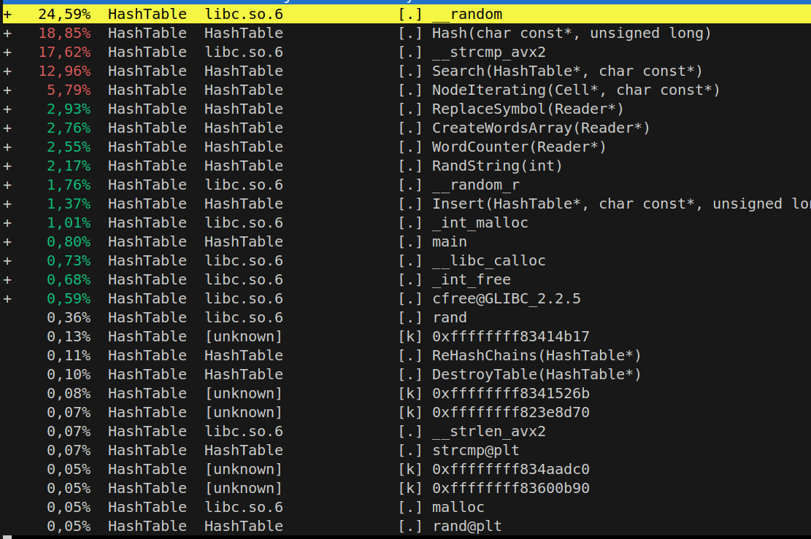

# Хэш-Таблица и её оптимизации

## Что такое хэш-таблица и не только

### Хэш-функция
Это функция, которая получает ключ и возвращает хэш. Ключом может быть любой тип данных: число или строка, например. Хэш тоже может быть любым нужным типом данных, обычно, это число. Хэш-функция должна вернуть два одинаковых хеша, получив одинаковые ключи.

Например ($hash = key$) уже хеш функция!

### Действия
В хэш-таблице хранятся пары (ключ; значение), которые можно:

1. Вставить пару
2. Удалить пару
3. Найти пару

Замечание: в моей таблице хранятся не пары (ключ; значение), а просто ключ, такая версия тоже допустима.

По своей сути, хэш-таблица - это прокачанный массив, в котором поиск происходит за $O(1)$ в лучшем случае и $O(n)$ в худшем (когда много коллизий). Это гораздо быстрее массива

### Коллизии
Простыми словами: получение одинакового хеша при хешировании разных ключей

### Как бороться с коллизиями?
Есть много способов: открытое хеширование, кукушкино, идеальное (если статическое количество ключей), но в этой работе остановимся на закрытом, оно же хеширование цепочками:

Ячейками хэш-таблицы являются односвязные списки, в каждом списке хранятся ключи с одинаковым хешем и, при поиске, происходит переход по элементам этого списка, пока не найдём нужный ключ или же не дойдём до пустого указателя, который означает конец списка

### Load factor
Или же коэффициент загруженности - это отношение размера таблицы к её текущей вместимости. Чем он больше, тем больше вероятность коллизий, что, разумеется, плохо, тк ведёт к увеличению времени действий. А хеширование цепочками позволяет достичь больших значений этого коэффициента.

 При достижении выбранного коэффициента, таблица рехешируется, то есть её вместимость увеличивается и заново считаются хеши для ключей в таблице.

## Сравнение хэш-функций

Для строк сравним 4 хэш-функции:

1) Strlen: хешем является длина строчки
2) Sum: хэш - сумма ASCII кодов букв
3) Polynom (полиномиальный хэш): возьмём простое число $p$(например, 31), и на каждой итерации к хешу, который изначально 0, будем добавлять (ASCII код буквы) * $p ^ {\text{кол-во итераций}}$
4) Crc32: Для подсчёта хеша используем заранее заготовленную таблицу чисел, делаем на каждой итерации xor хеша и числа из таблицы, номер которого зависит от ASCII кода текущей буквы.
[Функция взята отсюда](https://github.com/gcc-mirror/gcc/blob/master/libiberty/crc32.c)

### Метод измерения

1) Создадим массив случайных строк (количество случайных строк: NUM_KEYS = $1.000.000$)
2) Посчитаем хэш для каждой строки с помощью определённой хеш-функции, которую мы тестируем, и запишем в заранее заготовленные массив коллизий (его размер HASH_SIZE = 1000), замеряя время всех подсчётов
3) Найдём в массиве ячейку с максимальным числом коллизий, при этом будем считать сумму коллизий и сумму их квадратов
4) Найдём при помощи пункта 3 дисперсию распределения хешей по массиву. Дисперсия - крайне важный параметр, ведь чем она меньше, тем более равномерное распределение ключей по таблице, что крайне важно для хорошей хэш-функции.

### Результаты и вывод по сравнению

|   Функция     |   макс. Коллизии  |   Дисперсия   |   Время(c)    |
|---------------|-------------------|---------------|---------------|
|   Strlen      |   63034           |   6.15009e+07 |   0.0150402   |
|   Sum         |   2228            |   288327      |   0.0502694   |
|   Polynom     |   1113            |   1055.81     |   0.0497538   |
|   Crc32       |   1107            |   969.448     |   0.0711898   |

Наиболее близко к идеалу в аспекте максимального количества коллизий показали себя полиномиальный и Crc32 ($1110 \pm 3$ при идеале в $1000$), другие хеши показали себя гораздо хуже

Объяснить это легко:
Длина строки менее 20 символов, что даёт 19 уникальных хешей, всего строк 1000000, в среднем 52632 строки в одной ячейке
С суммой аналогично, ascii-коды букв лежат от 65 до 122, итого уникальных ключей не более, чем 122*20 = 2440, в среднем количество ключей в одной ячейке не менее 410 строк

Из-за простоты реализации и минимального времени при наилучшем распределении ключей в не оптимизированной версии будет использоваться полиномиальный хэш

## Оптимизации на низком уровне

### Суть и мотивация
С хэш-таблицей всё ясно, это более быстрый массив, но что, если сделать коэффициент загрузки просто огромным (например 16), искусственно увеличивая время действий, и попытаться оптимизировать её? В этом и состоит эта работа.

### Скорость программы
Ключевое правило: скорость программы определяется её самым медленным участком. Но как его найти?

Для этого будем использовать perf! А точнее некоторые из её функций:

1. perf top (открыв во одной консоли, а запустив программу в другой, можно в реальном времени смотреть, какая из функций сколько процентов процессора потребляет)

2. perf record -g ./<название программы> && perf report (вторая консоль не нужна, покажет те же данные, только статично, более подробно и измеренные на протяжении всей программы)

3. perf stat ./<название программы> (покажет общие данные программы: время, количество циклов, инструкций, веток)

### Методы оптимизации

В этом семестре мной было изучено несколько способов оптимизации функций, а точнее переписать её, используя:

1. Ассемблер (Я использую nasm x86_64)
2. Векторные инструкции (они же интринсики, они же SIMD, вплоть до AVX2)
3. Встроенный ассемблер

### Важно понимать!!!

Оптимизации - это круто, очень круто, но есть большое НО: чем больше строк на ассемблере или использующих векторные инструкции, тем менее читаем код, потому нужно следить за большим значением эффективности $\mu = \frac{ускорение}{\text{строки на ассемблере}}$, то есть, если программа была ускорена на $0,001$% с помощью $1000$ строк на ассемблере, то оптимизация не блещет эффективностью

### Измерение

!Процессор AMD Ryzen 7 3700U with Radeon Vega Mobile Gfx с максимальной частотой 2300 MHz!

!Все измерения проводятся с флагом ускорения -O0! Почему? Чтобы оптимизировать лучше, чем -О3, нужно сойти с ума)

Для точного измерения необходимо зафиксировать частоту процессора. Я пишу эту программу на линукс, благодаря чему могу использовать cpupower:

1. Поставим его на линукс:

            sudo apt update
            sudo apt install linux-tools-common

2. Зафиксируем частоту на максимальной:

        sudo cpupower frequency-set -g performance

3. Посмотрим текущее значение:

         cpupower frequency-info

Возьмём большой текст (я взял Войну и мир на английском, у неё 563422 слов, из них 41587 уникальных) и будем вставлять пословно в таблицу, при этом ища на этом шаге случайную строку:

    for (size_t i = 0; i < read->count_words; i++)
        {
            Insert(table, read->words[i]);

            int random = rand() % 32;
            char *rand_str = RandString(random);

            Search(table, rand_str);

            free(rand_str);
        }

Где read->count_words - считанное из файла с текстом количество слов

Запустив: perf record -g ./HashTable && perf report, получим:

Значит, нужно оптимизировать: поиск, хэш-функцию и сравнение строк!

Замерим общее время с помощью perf stat ./HashTable

Протестировав 7 раз с помощью perf stat, получим средний результат:
|   Номер теста |   1    |   2    |   3    |   4    |   5    |   6    |   7    |
|---------------|--------|--------|--------|--------|--------|--------|--------|
|   время(ms)       |856.12  |829.58  |836.78  |831.44  |842.04  |826.32  |825.37  |

Среднее значение: $835,38$ ms

## Ускоряемся!

### Ускорение хэш-функции

Одной из наиболее подходящих функций на стадии сравнения была Crc32, она была несколько медленнее полиномиальной, но у неё есть SIMD аналог:

        inline unsigned int _mm_crc32_u8(unsigned int __C, unsigned char __V)

Используем её вместо не оптимизированного хеша и изучим ускорение программы

Протестировав 7 раз с помощью perf stat, получим средний результат:
|   Номер теста |   1    |   2    |   3    |   4    |   5    |   6    |   7    |
|---------------|--------|--------|--------|--------|--------|--------|--------|
|   время(ms)       |783.99  |796.97  |785.93  |780.25  |764.31  |793.31  |774.01  |

Среднее значение: $782,68$ ms

Ускорение в $k = \frac{835,38}{782,68} = 1,06733$, то есть на $6,733$%

### Ускорение поиска
Поиск является самым узким местом программы, поэтому предлагаю оптимизировать его наиболее агрессивно: перепишем функцию на ассемблер!

Ассемблер создаёт сразу несколько проблему:

Использование хэш-функции: нужно использовать си-функцию из ассемблерного кода, для этого:

1) Записать прототип определённого вида в .h файле хэш-функцию:

            extern "C" size_t Hash_CRC32(const char* key, size_t capacity);
2) Объявить функцию в ассемблерном коде (аналог include):

            extern Hash_CRC32

Теперь измерим по 7 раз с помощью perf stat, получим средний результат:
|   Номер теста |   1    |   2    |   3    |   4    |   5    |   6    |   7    |
|---------------|--------|--------|--------|--------|--------|--------|--------|
|   время(ms)       |711.59  |714.77  |734.61  |738.17  |725.56  |729.19  |726.03  |

Среднее значение: $725,70$ ms

Ускорение в $k = \frac{782,68}{725,70} = 1,07852$, то есть на $7,852$%

### Ускорение сравнения строк
Оптимизируем одно из самых узких мест: strcmp. Перепишем её с помощью встроенного ассемблера:

        int AsmStrcmp(const char *a, const char *b)
        {
            int result;

            __asm
            (
                "loop_cmp:\n"
                "movb (%0), %%al\n"     // Загружаем байт из a

                "cmpb (%1), %%al\n"     // Сравниваем с байтом из b
                "jne end\n"              // Если не равны -> выход

                "inc %0\n"              // Переходим к следующему символу
                "inc %1\n"
                "test %%al, %%al\n"     // Проверяем на конец строки
                "jnz loop_cmp\n"              // Если не конец -> повторяем

                "end:\n"
                "sete %%cl\n"           // Устанавливаем промежуточный результат (1 если равны)
                "movzbl %%cl, %2\n"

                : "+r" (a), "+r" (b), "=r" (result)
                : 
                : "rax", "rcx", "cc"
            );
            
            return (1-result); //дла соответствия strcmp
        }

Теперь измерим 7 раз с помощью perf stat, получим средний результат:
|   Номер теста |   1    |   2    |   3    |   4    |   5    |   6    |   7    |
|---------------|--------|--------|--------|--------|--------|--------|--------|
|   время(ms)       |475.10  |475.11  |483.34  |472.22  |469.89  |473.76  |480.66  |

Среднее значение: $475,73$ ms

Ускорение в $k = \frac{725,70}{475,73} = 1,52545$, то есть программа  на $52,545$%. 

## Вывод
Программа ускорилась в $1,756$ раз, если убрать последнюю оптимизацию. Посчитаем коэффициент $\mu = \frac{ускорение}{\text{строки на ассемблере}} = \frac{0,756}{1 + 48} = 1,5429 * 10^{-2}$, что эквивалентно $1,543$ процентам.